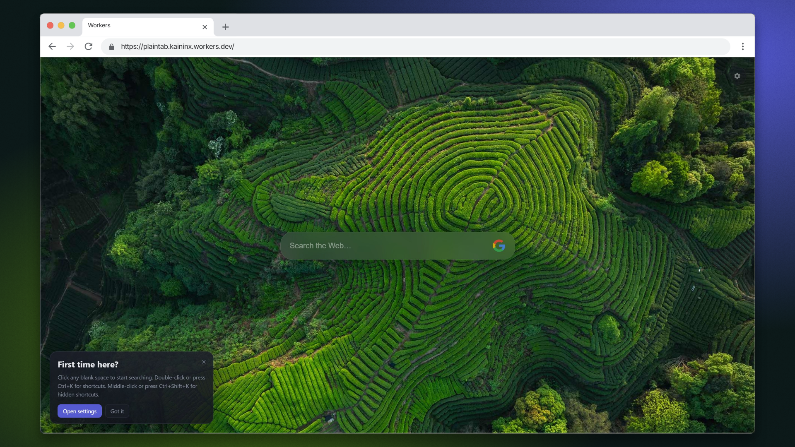
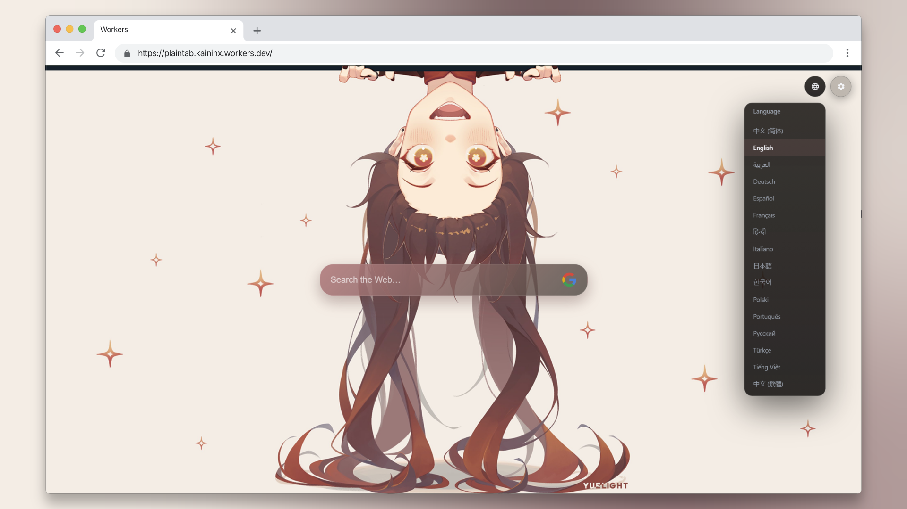
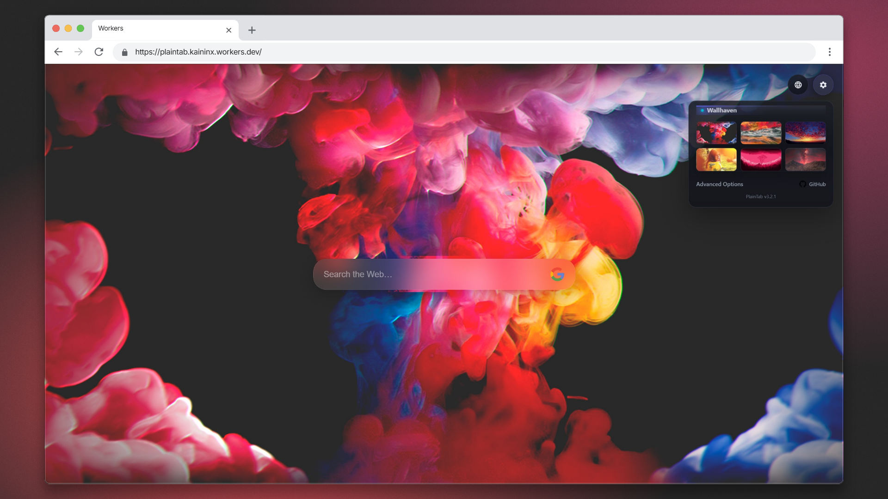
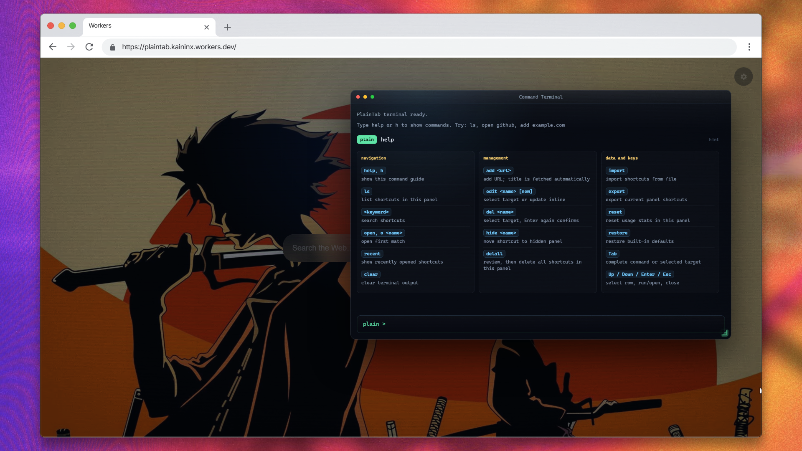
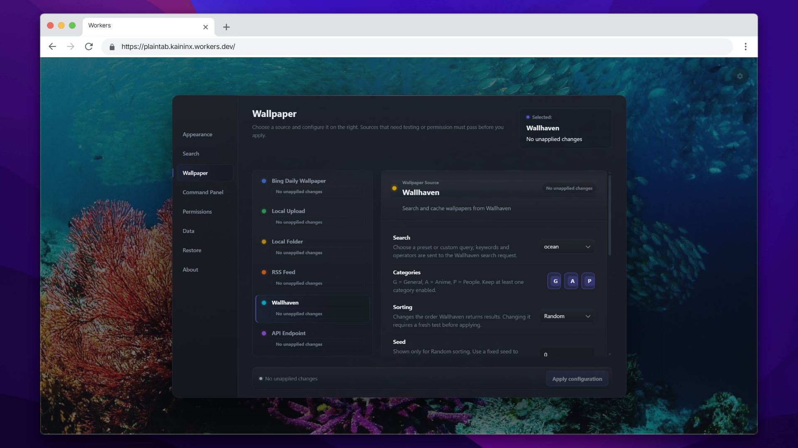
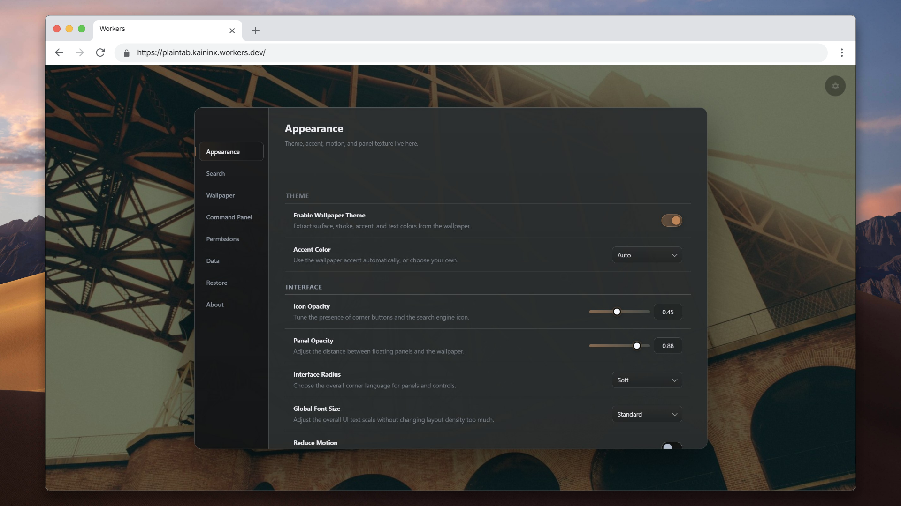

<p align="center">
  
</p>

<h1 align="center">PlainTab</h1>

<p align="center">
  Chrome और Edge के लिए तेज़, शांत और वॉलपेपर-केंद्रित नया टैब पेज।
</p>

<p align="center">
  <a href="../README.md">English</a> · <a href="https://chromewebstore.google.com/detail/plaintab-%C2%B7-minimal-new-ta/jhpfjcefcmooplmaimgdafohdlhacjdo">Chrome Web Store</a> · <a href="https://plaintab.kaininx.workers.dev">लाइव डेमो</a> · <a href="technical/README_en.md">तकनीकी नोट्स</a> · <a href="changelog-i18n/hi.txt">बदलाव सूची</a>
</p>

<p align="center">
  <a href="../LICENSE"></a>
  
  
  
  
</p>

<div align="center">
  
  
  <br>
  
  
</div>

## PlainTab क्या है

PlainTab Chrome और Edge के लिए Manifest V3 आधारित नया टैब एक्सटेंशन है। यह डिफ़ॉल्ट नए टैब को साफ़ वॉलपेपर, बदली जा सकने वाली खोज पट्टी और ज़रूरत पड़ने पर दिखने वाले शॉर्टकट से बदल देता है।

यह उन लोगों के लिए है जिन्हें शांत और तुरंत खुलने वाला आरंभ पेज चाहिए: कोई समाचार फ़ीड नहीं, कोई प्रचार कार्ड नहीं, कोई खाता प्रणाली नहीं और विजेट से भरा डैशबोर्ड नहीं। नया टैब खोलें, वॉलपेपर देखें, खोजें या URL लिखें, और आगे बढ़ें।

यही पेज `index.html` सीधे खोलकर सामान्य वेब पेज की तरह भी चल सकता है, इसलिए प्रोजेक्ट को आज़माना, पढ़ना और बदलना आसान है।

## आज़माएँ

### इंस्टॉल करें

[Chrome Web Store से PlainTab इंस्टॉल करें](https://chromewebstore.google.com/detail/plaintab-%C2%B7-minimal-new-ta/jhpfjcefcmooplmaimgdafohdlhacjdo)

### लाइव डेमो खोलें

[plaintab.kaininx.workers.dev](https://plaintab.kaininx.workers.dev)

### स्थानीय रूप से चलाएँ

```bash
git clone https://github.com/kaininx/PlainTab.git
```

एक्सटेंशन मोड:

1. `chrome://extensions` खोलें।
2. Developer mode चालू करें।
3. "Load unpacked" चुनें।
4. PlainTab प्रोजेक्ट फ़ोल्डर चुनें।

वेब मोड:

ब्राउज़र में `index.html` सीधे खोलें।

कोई निर्भरता, पैकेज मैनेजर या बिल्ड चरण नहीं चाहिए।

## PlainTab क्यों

### पहले वॉलपेपर, कम खाली इंतज़ार

PlainTab इस अनुभव पर ध्यान देता है कि नया टैब खुलते ही कुछ दिखे। यह `localStorage` में हल्का आरंभिक पूर्वावलोकन रखता है, फिर पूरा वॉलपेपर लोड करना, कैश और थीम रंग निकालना पहले पेंट के बाद करता है।

महसूस होने वाली गति यहाँ उत्पाद अनुभव का हिस्सा है, केवल प्रदर्शन आँकड़ा नहीं।

### डिफ़ॉल्ट रूप से शांत

होम पेज पर वॉलपेपर, खोज और कुछ नियंत्रण रहते हैं। शॉर्टकट, छिपे हुए लिंक, सेटिंग्स, बैकअप और उन्नत वॉलपेपर विकल्प मौजूद हैं, लेकिन वे स्क्रीन पर फैलते नहीं।

### लचीले वॉलपेपर स्रोत

आप Bing दैनिक वॉलपेपर, Wallhaven, अपलोड किए गए चित्र, स्थानीय फ़ोल्डर, RSS चित्र फ़ीड, अपनी चित्र API या वीडियो वॉलपेपर इस्तेमाल कर सकते हैं। PlainTab रोज़मर्रा के लिए सरल है और अनुकूलन के लिए पर्याप्त जगह देता है।

### खोज और शॉर्टकट बिना भीड़ के

खोज पट्टी की स्थिति, आकार, कोना, पारदर्शिता, दिखने का तरीका, खोज इतिहास और खोज इंजन व्यवहार बदला जा सकता है। शॉर्टकट कमांड पैलेट में रहते हैं, जहाँ लिंक खोजे, जोड़े, संपादित, आयात और छिपाए जा सकते हैं।

## सुविधाएँ

| सुविधा | विवरण |
|--------|-------|
| नया टैब बदलना | इंस्टॉल के बाद ब्राउज़र का नया टैब बदलता है |
| स्वतंत्र वेब मोड | एक्सटेंशन पैक किए बिना `index.html` से चलता है |
| तेज़ वॉलपेपर आरंभ | आरंभिक पूर्वावलोकन से सफेद खाली चमक कम होती है |
| Bing वॉलपेपर | Bing दैनिक वॉलपेपर का समर्थन |
| Wallhaven वॉलपेपर | Wallhaven से ब्राउज़ और सेट करने का समर्थन |
| स्थानीय वॉलपेपर | चित्र अपलोड, गैलरी और स्थानीय फ़ोल्डर चयन |
| RSS / API वॉलपेपर | कस्टम चित्र फ़ीड और API से जुड़ता है |
| वीडियो वॉलपेपर | वीडियो को वॉलपेपर की तरह उपयोग कर सकते हैं |
| खोज पट्टी | स्थिति, आकार, शैली, पारदर्शिता और दिखने का तरीका |
| खोज इतिहास | हाल की खोजें सहेजें या बंद करें |
| कमांड पैलेट | होम पेज को भरे बिना शॉर्टकट प्रबंधित करता है |
| छिपी जगह | लिंक उपलब्ध रहते हैं, पर सीधे दिखाई नहीं देते |
| सेटिंग्स पैनल | इंटरफ़ेस, वॉलपेपर, हॉटकी, डेटा और भाषा |
| बैकअप और पुनर्स्थापन | आयात, निर्यात और एन्क्रिप्टेड बैकअप |
| बहुभाषी UI | 16 भाषा पैक शामिल |
| AI सहयोग रिकॉर्ड | AI-सहायता प्राप्त विकास के नोट्स और दस्तावेज़ |

<div align="center">
  
  
</div>

## डेवलपर्स के लिए

PlainTab जानबूझकर सरल तकनीक रखता है:

- साधारण JavaScript, CSS और ब्राउज़र API।
- कोई `npm`, `package.json`, फ्रेमवर्क या बंडलर नहीं।
- एक्सटेंशन मोड और वेब मोड के लिए एक ही कोडबेस।
- Manifest V3 कॉन्फ़िगरेशन `manifest.json` में।
- रनटाइम स्क्रिप्ट सीधे `index.html` से लोड होती हैं।

शुरू करने के लिए:

- [तकनीकी नोट्स](technical/README_en.md): आर्किटेक्चर और ज़िम्मेदारियाँ।
- [रिलीज़ नोट्स](RELEASE_NOTES.md): सुविधा इतिहास।
- [मेमोरी और स्टोरेज डायग्नोस्टिक](ai-tasks/20260519-memory-storage-diagnostic-report.md): वॉलपेपर कैश व्यवहार।
- [AI agent निर्देश](../AGENTS.md): प्रोजेक्ट नियम।

सावधानी वाले क्षेत्र:

- आरंभिक पथ सफेद चमक कम करने के लिए बनाया गया है।
- वॉलपेपर रेंडरिंग स्थिर back layer और transition front layer का उपयोग करती है।
- बड़े वॉलपेपर डेटा को स्टोरेज मॉड्यूल और IndexedDB से संभालना चाहिए।
- migration न हो तो localStorage key compatibility बनाए रखें।
- एक्सटेंशन अनुमतियाँ Chrome Web Store समीक्षा अपेक्षाओं से मेल खानी चाहिए।

## प्रोजेक्ट संरचना

```text
PlainTab/
├── index.html              # नया टैब और वेब entry
├── manifest.json           # Chrome / Edge Manifest
├── css/                    # सुविधा के अनुसार styles
├── js/                     # runtime modules
├── js/wallpaper/           # वॉलपेपर, स्रोत और theme extraction
├── wasm/                   # theme engine और build scripts
├── _locales/               # extension i18n messages
├── docs/                   # दस्तावेज़ और रिलीज़ नोट्स
├── icon/                   # icons
└── imgs/                   # screenshots और store assets
```

## PlainTab क्या नहीं करेगा

PlainTab संयमित रहेगा। समाचार फ़ीड, ट्रेंड, सुझाव, आरंभिक विज्ञापन, प्रायोजित कार्ड, बड़े मौसम/कैलेंडर/कार्य पैनल, खाता प्रणाली, सामाजिक सुविधाएँ, क्लाउड सामग्री फ़ीड, होम पेज पर दर्जनों स्थिर शॉर्टकट और अपने-आप चलने वाली प्रचार सामग्री वर्तमान दिशा का हिस्सा नहीं हैं।

Safari संस्करण अभी योजना में नहीं है, क्योंकि व्यक्तिगत प्रोजेक्ट के लिए प्रकाशन और रखरखाव लागत व्यावहारिक नहीं है।

## AI सहयोग और सीखना

PlainTab को कोड, दस्तावेज़, refactor, रिलीज़ तैयारी और डायग्नोस्टिक में काफ़ी AI सहयोग के साथ बनाया गया है। यह खिलौना डेमो नहीं है: इसमें वास्तविक UI, स्थायी सेटिंग्स, आयात/निर्यात, वॉलपेपर स्टोरेज, बहुभाषी UI और एक्सटेंशन/वेब runtime paths हैं।

यह नया टैब एक्सटेंशन बनाना, फ्रेमवर्क के बिना छोटा frontend व्यवस्थित करना, AI-सहायता प्राप्त विकास का दस्तावेज़ीकरण और उत्पाद संयम का तकनीकी निर्णयों पर प्रभाव समझने के लिए अच्छा उदाहरण है।

## रोडमैप

आगे अधिक स्थिर वॉलपेपर स्रोत, बेहतर सेटिंग्स प्रवाह, साफ़ तकनीकी दस्तावेज़, अधिक पूर्ण AI विकास रिकॉर्ड और API/रखरखाव लागत सही होने पर Firefox समर्थन पर काम हो सकता है।

## योगदान

Issues और pull requests स्वागत योग्य हैं, खासकर ब्राउज़र compatibility, वॉलपेपर स्रोत, दस्तावेज़ और छोटे UI सुधारों के लिए।

आरंभ, वॉलपेपर, स्टोरेज, खोज, सेटिंग्स या कमांड पैलेट व्यवहार बदलने से पहले [AGENTS.md](../AGENTS.md) और `.claude/rules/` पढ़ें। छोटे और केंद्रित बदलाव बेहतर हैं।

## भाषाएँ

<details>
<summary>README अनुवाद</summary>

- [English](../README.md)
- [简体中文](README_zh-CN.md)
- [繁體中文](README_zh-TW.md)
- हिन्दी
- [Español](README_es.md)
- [العربية](README_ar.md)
- [Français](README_fr.md)
- [Português](README_pt_BR.md)
- [Русский](README_ru.md)
- [Deutsch](README_de.md)
- [日本語](README_ja.md)
- [Italiano](README_it.md)
- [Türkçe](README_tr.md)
- [Tiếng Việt](README_vi.md)
- [한국어](README_ko.md)
- [Polski](README_pl.md)

</details>

## लिंक

- [बदलाव सूची](changelog-i18n/hi.txt)
- [विस्तृत रिलीज़ नोट्स](RELEASE_NOTES.md)
- [तकनीकी नोट्स](technical/README_en.md)
- [मेमोरी और स्टोरेज डायग्नोस्टिक](ai-tasks/20260519-memory-storage-diagnostic-report.md)
- [लाइव डेमो](https://plaintab.kaininx.workers.dev)
- [Chrome Web Store](https://chromewebstore.google.com/detail/plaintab-%C2%B7-minimal-new-ta/jhpfjcefcmooplmaimgdafohdlhacjdo)
- [GitHub](https://github.com/kaininx/PlainTab)

## लाइसेंस

PlainTab [MIT License](../LICENSE) के तहत open source है।

[Kaelri](https://github.com/kaininx) द्वारा बनाया और maintained किया गया।
